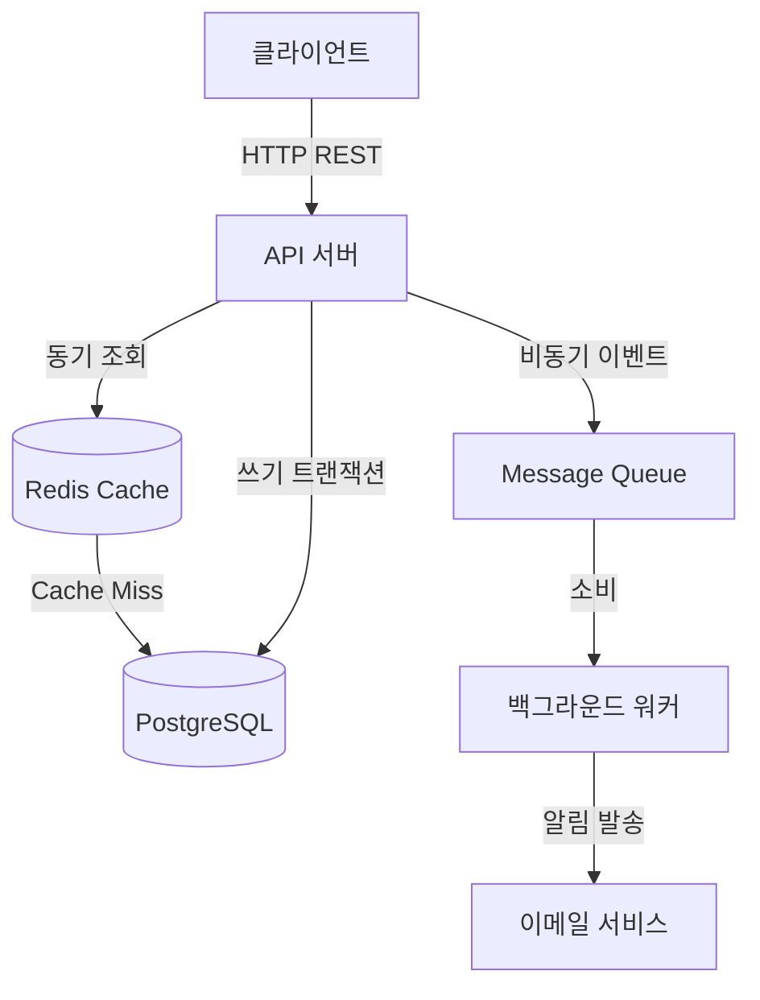

# 아키텍처 스타일 결정 가이드

> [[10-project-classification]]에서 도출한 프로젝트 특성을 바탕으로, 어떤 아키텍처 스타일과 데이터 흐름 방식이 적합한지 판단하는 매핑 가이드.

---

## Overview

프로젝트 분류가 끝났다면, 그 결과를 입력으로 아키텍처 스타일을 선택한다. 이 가이드는 규모·읽기/쓰기 비율·일관성 요구·데이터 구조라는 4가지 축으로 의사결정을 구조화한다. 에이전트는 이 가이드의 출력을 ADR([[15-adr-and-c4-model]])로 문서화한다.

---

## Key Concepts

### 1. 프로젝트 규모 → 아키텍처 스타일

| 조건 | 추천 스타일 | 이유 |
|---|---|---|
| 1인 개발, MVP, 사용자 수 적음 | **모듈형 모놀리식** | 배포/운영 단순, 개발 속도 빠름, 추후 분리 용이 |
| 기능별 독립 배포/스케일링 필요 | **마이크로서비스** | 서비스별 독립 확장, 단 운영 복잡도 증가 |
| 이벤트 발생量 많고 비동기 핵심 | **이벤트 드리븐** | 느슨한 결합, 비동기 처리에 유리 |
| 서버 운영 부담 최소화 | **서버리스** | 트래픽 기반 과금, 운영 자동화 |

> **개인 프로젝트 기본값**: 모듈형 모놀리식으로 시작 → 특정 모듈 부하가 커지면 그 부분만 분리하는 점진적 접근이 안전하다.  
> 안티패턴: 처음부터 마이크로서비스로 시작하는 "Golden Hammer" ([[16-architecture-antipatterns]] 참고)

### 2. 읽기/쓰기 비율 → 데이터 처리 패턴

**읽기가 압도적으로 많은 경우** (피드, 콘텐츠 사이트):
- 캐싱 레이어 도입 (Cache-Aside 패턴) → [[14-system-design-basics]]
- 읽기 전용 복제본(Read Replica) 고려
- CQRS로 읽기/쓰기 모델 분리 고려 (소규모에서는 과할 수 있음)

**쓰기가 많고 처리 순서가 중요한 경우** (로그 수집, 주문 처리):
- 메시지 큐를 통한 비동기 처리 (Producer-Consumer)
- 쓰기는 빠르게 받고, 처리는 백그라운드 워커로 분리

### 3. 일관성 요구 → 통신/트랜잭션 방식

| 일관성 요구 | 통신 방식 | 트랜잭션 처리 |
|---|---|---|
| 강한 일관성 (결제, 재고) | 동기(REST/RPC) + 단일 DB | ACID 트랜잭션, 분산이면 Saga 패턴 |
| 결과적 일관성 (알림, 통계) | 비동기(메시지 큐, 이벤트) | 이벤트 기반 업데이트, 재시도/보정 로직 |

### 4. 데이터 구조 → DB 선택

| 데이터 특성 | 추천 DB |
|---|---|
| 정형 데이터 + 관계/트랜잭션 중요 | RDBMS (PostgreSQL, MySQL) |
| 스키마 자주 변경, JSON 형태 | 문서형 DB (MongoDB) |
| 단순 키-값 조회, 캐싱 | KV 스토어 (Redis) |
| 복잡한 관계 탐색 (추천, 소셜) | 그래프 DB (Neo4j) |
| 대량 로그/시계열 분석 | 컬럼형 (TimescaleDB, ClickHouse) |

> **폴리글랏 퍼시스턴스 주의**: 여러 DB를 섞는 것은 강력하지만, 개인 프로젝트에서는 1~2개 DB로 시작하고 필요할 때 추가하는 것을 권장.

---

## Details

### 5. 데이터 흐름 설계 체크리스트

에이전트는 아키텍처를 확정하기 전, 다음 데이터 흐름을 명시적으로 그려야 한다:

```
1. 사용자/클라이언트 요청이 진입하는 지점
   (API Gateway / 단일 엔드포인트)

2. 요청이 동기로 처리되는 부분과 비동기로 위임되는 부분의 경계

3. 데이터가 저장되는 위치와 그 데이터를 읽는 다른 컴포넌트

4. 캐시가 적용되는 지점과 무효화(invalidation) 시점

5. 외부 서비스/API와의 연동 지점 및 장애 시 대응
   (타임아웃, 재시도, 서킷브레이커)
```

### 6. 최종 출력 형식

에이전트는 설계 결과를 ADR(Architecture Decision Record) 형식으로 정리하고, C4 모델의 표기법으로 Context/Container 수준 다이어그램을 함께 제시한다. → [[15-adr-and-c4-model]]

---

## Examples / Code

### 의사결정 흐름 예시

```
[입력: 프로젝트 특성]
유형: 웹 서비스 (CRUD 중심)
규모: 1인 개발, 초기 수백 명
읽기/쓰기: 읽기 70% / 쓰기 30%
일관성: 강한 일관성 필요 (주문)
운영: 최소 비용, 1인 운영

[의사결정 과정]
규모 축 → 모듈형 모놀리식 선택 (1인 개발, MVP)
읽기/쓰기 → Redis 캐시 도입 (읽기 70%)
일관성 → RDBMS + 단일 DB 트랜잭션 (강한 일관성)
DB 선택 → PostgreSQL (정형 + 관계 중요)

[결론]
아키텍처: 모듈형 모놀리식
기술 스택: Spring Boot + PostgreSQL + Redis
확장 계획: 주문 모듈만 트래픽 폭증 시 분리 고려
```

### Mermaid 데이터 흐름 다이어그램 예시



---

## Related

- [[10-project-classification]] — 분류 체크리스트 (이 가이드의 입력)
- [[12-architecture-patterns]] — 선택 가능한 패턴 상세
- [[14-system-design-basics]] — 캐싱, 로드 밸런싱, 통신 기초
- [[15-adr-and-c4-model]] — 결정 기록(ADR)과 시각화(C4) 방법
- [[16-architecture-antipatterns]] — 흔한 설계 실수 목록
