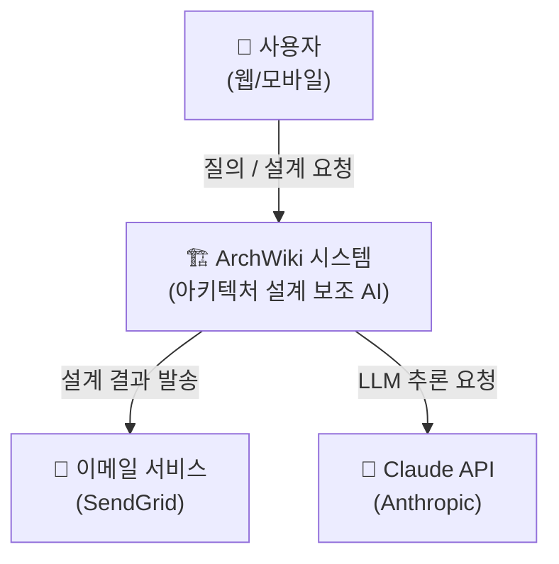
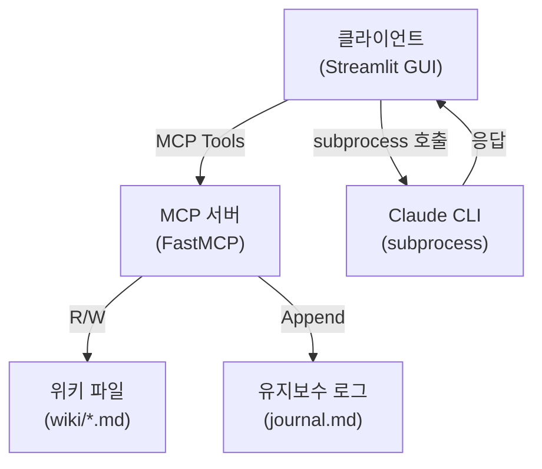

# ADR & C4 모델 — 아키텍처 결정 기록과 시각화

> ADR(Architecture Decision Record)은 설계 결정의 이유를 남기는 문서이고, C4 모델은 아키텍처를 4단계 추상화로 시각화하는 방법론이다. 에이전트는 설계 완료 시 반드시 이 두 가지를 산출물로 작성한다.

---

## Overview

아키텍처 결정이 "무엇"인지는 코드에 남지만, "왜" 그렇게 결정했는지는 코드에 남지 않는다. ADR은 그 이유를 기록하여 미래의 나(또는 팀)가 잘못된 방향으로 재설계하는 것을 방지한다. C4 모델은 다이어그램을 통해 이해관계자별로 적절한 수준의 아키텍처 뷰를 제공한다.

---

## Key Concepts

### ADR (Architecture Decision Record)

**정의**: 중요한 설계 결정을 내릴 때마다 작성하는 짧은 문서. "무엇을 왜 결정했는가"를 기록한다.

#### MADR 스타일 템플릿

```markdown
# ADR-NNN: [짧은 결정 제목 — 명령문 형태]
예: "사용자 인증 방식으로 JWT 채택"

## 메타데이터
- 날짜: YYYY-MM-DD
- 상태: 제안됨 / 채택됨 / 폐기됨 / 대체됨

## 컨텍스트와 문제 정의
어떤 문제/질문을 해결하기 위한 결정인지 2~3문장.
(가능하면 질문 형태: "어떤 방식으로 사용자 인증을 처리해야 하는가?")

## 결정 기준 (Decision Drivers)
- 무료 인프라 사용
- 모바일 앱과의 호환성
- 향후 소셜 로그인 확장 가능성

## 고려한 옵션들
- 옵션 1: Session-based 인증
- 옵션 2: JWT 기반 인증
- 옵션 3: OAuth2 + 외부 Provider

## 결정 결과
선택한 옵션: "옵션 2 — JWT 기반 인증"
선택 이유: 모바일 앱 호환성 및 서버 무상태(Stateless) 확장에 유리.
           무료 인프라 환경에서 세션 저장소 없이 운영 가능.

## 옵션별 장단점
### 옵션 1: Session-based
- 장점: 즉시 토큰 무효화 가능
- 단점: 서버에 세션 저장소 필요, 수평 확장 어려움

### 옵션 2: JWT
- 장점: Stateless, 모바일 친화적
- 단점: 토큰 만료 전 무효화 어려움 (Refresh Token으로 완화)

## 결과 / 영향
- Refresh Token 저장소(Redis) 추가 필요
- 토큰 만료 정책 설계 필요 (Access: 15분, Refresh: 7일)
```

### C4 모델 — 4단계 추상화

지도처럼 "전체 → 점점 확대"하는 방식으로 아키텍처를 표현한다.

| 레벨 | 이름 | 내용 | 대상 독자 |
|---|---|---|---|
| 1 | System Context | 시스템 전체 + 외부 의존성 | 이해관계자 전체 |
| 2 | Container | 배포 단위(서버, DB, 캐시 등)와 데이터 흐름 | 개발자, 아키텍트 |
| 3 | Component | 특정 컨테이너 내부 모듈 구조 | 개발자 |
| 4 | Code | 클래스 다이어그램 (선택) | 개발자 (IDE 자동 생성 권장) |

**에이전트 출력 규칙**:
1. 최소 **System Context + Container Diagram** 필수 작성
2. Mermaid 코드 블록으로 마크다운에 직접 포함

---

## Details

### Tyree-Akerman 스타일 (대안 ADR 템플릿)

더 상세한 트레이드오프 분석이 필요한 경우:

```markdown
# 결정 사항: [제목]

## 이슈
해결해야 하는 문제 또는 아키텍처 질문

## 가정
이 결정의 전제 조건들

## 대안 (Alternatives)
| 대안 | 장점 | 단점 | 비용 |
|---|---|---|---|
| A | ... | ... | ... |
| B | ... | ... | ... |

## 결정
채택한 대안과 이유

## 영향
이 결정으로 인한 후속 영향, 재검토 시점
```

### C4 다이어그램 표기 도구

| 도구 | 특징 |
|---|---|
| **Mermaid** | 마크다운에 바로 삽입, GitHub 렌더링 지원 (권장) |
| PlantUML + C4-PlantUML | C4 전용 매크로 제공, 일관된 표기 |
| Structurizr | C4 전용 모델링 DSL, 가장 강력하지만 별도 설치 필요 |

---

## Examples / Code

### Level 1: System Context Diagram (Mermaid)



### Level 2: Container Diagram (Mermaid)



### ADR 작성 예시 (개인 프로젝트: ArchWiki)

```markdown
# ADR-001: MCP 서버 구현체로 FastMCP 채택

## 메타데이터
- 날짜: 2026-06-13
- 상태: 채택됨

## 컨텍스트와 문제 정의
위키 도구를 Claude 에이전트가 사용할 수 있도록 MCP 서버로 노출해야 한다.
어떤 MCP 서버 구현 방식을 선택할 것인가?

## 결정 기준
- Python 기반 (기존 위키 코드와 언어 통일)
- 빠른 구현 (MVP 우선)
- 공식 MCP SDK와 호환

## 결정 결과
FastMCP 채택. Python 데코레이터 기반 API로 Tool 정의가 간결하고,
공식 MCP 프로토콜과 완전 호환. anthropic/mcp-python 대비 보일러플레이트 최소화.
```

---

## Related

- [[11-architecture-decision-guide]] — ADR을 작성하는 결정 가이드
- [[10-project-classification]] — ADR의 컨텍스트 정의에 사용하는 분류 결과
- [[12-architecture-patterns]] — ADR로 기록할 주요 패턴 선택
